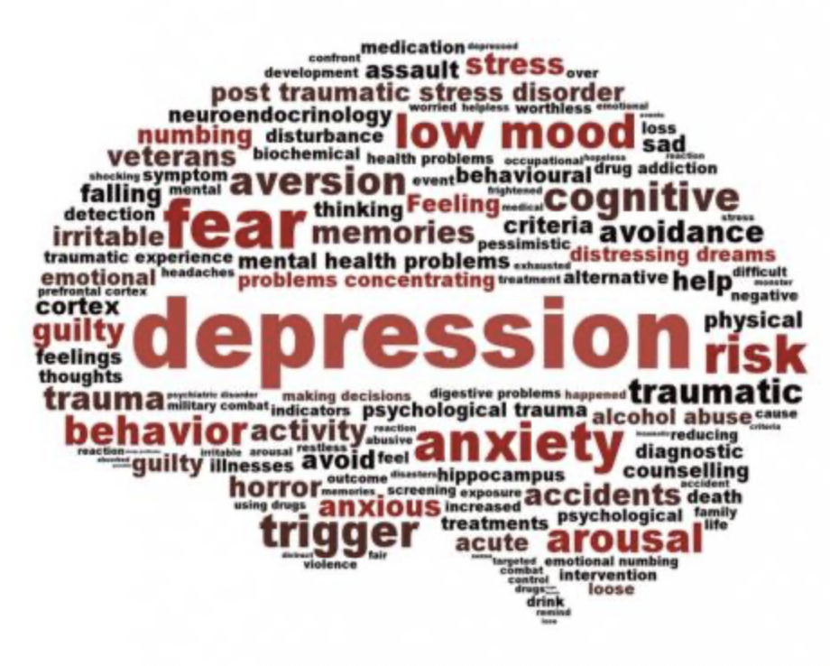

### *Objectives*
The main goals of this project are to

* examine whether there are gender differences in two mental health outcomes: self-reported depression and number of days mental health not good in the past 30 days.
* examine whether presence of children in the household affects women and men's mental health differently.
* compare state-level gender differences in the two mental health outcomes.

### *Screencast*

### *Team*
Yichen Lyu (yl5220)

Ziqing Wang (zw2899)

Zhaoqianyu Xiong (zx2424)

Zirui Zhang (zz3039)